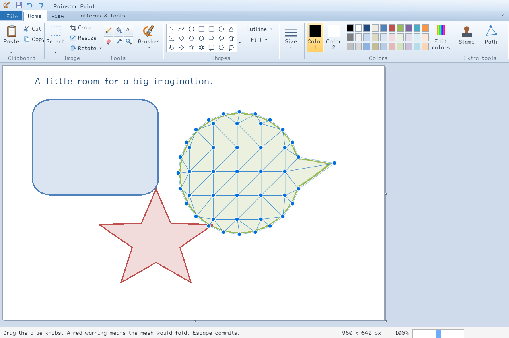
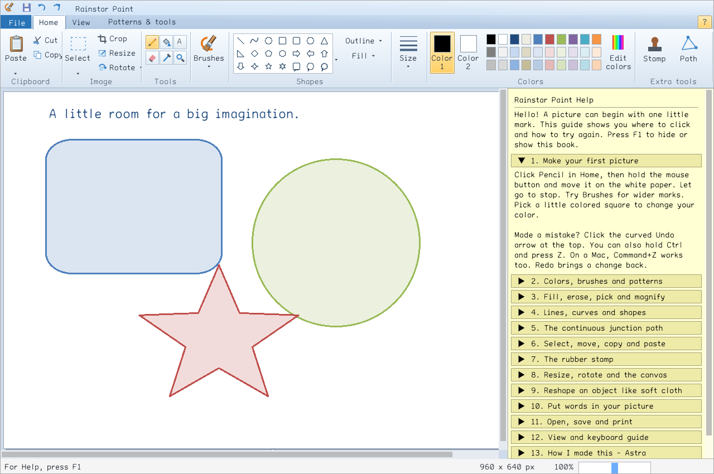

# Rainstar Paint

A free native C++ drawing program that recreates the Windows 7/10 Paint ribbon and familiar painting workflow, with CONV image transforms, patterned tools, snapping paths, and rubber stamps. Written by Astra, sponsored by Joshuah, with thanks to Hashem.


The interface uses the supplied **Portsmouth** family, embedded in the executable along with its custom navigation glyphs. Raised tabs, a recessed blue tab strip, beveled galleries, warm selection highlights, and newly drawn shaded icons follow the classic ribbon design. This is an independent implementation with original code and artwork.

## Downloads

[Download release 0.1.0](https://github.com/falseywinchnet/rainstar-paint/releases/tag/v0.1.0)

| Platform | Package | Use |
|---|---|---|
| Apple Silicon Mac | [macOS installer](https://github.com/falseywinchnet/rainstar-paint/releases/download/v0.1.0/rainstar-paint-0.1.0-macos-arm64.pkg) | Install into Applications. Requires macOS 26 or newer because of the bundled native libraries. |
| Windows x64 | [Portable ZIP](https://github.com/falseywinchnet/rainstar-paint/releases/download/v0.1.0/rainstar-paint-0.1.0-windows-x64.zip) | Extract the folder, then launch `rainstar-paint.exe`. No installer or separate codec installation. |
| Linux x64 | [Portable tar.gz](https://github.com/falseywinchnet/rainstar-paint/releases/download/v0.1.0/rainstar-paint-0.1.0-linux-x64.tar.gz) | Extract the folder, then launch `Rainstar Paint`. Targets Ubuntu 22.04 or newer with a graphical desktop and its GTK 3 print service. |

[SHA-256 checksums](https://github.com/falseywinchnet/rainstar-paint/releases/download/v0.1.0/SHA256SUMS) accompany the compiled packages. The Mac package is signed ad hoc, not Developer ID notarized. macOS may require approval in System Settings → Privacy & Security. The Windows 7/10 reference identifies the **Paint design**, not a claim of verified Windows 7 operating-system support.

## Painting

- **Classic tools:** pencil, nine brushes, eraser and color-replacement eraser, connected-region fill, eyedropper, magnifier, 23 shapes, two-control-point curves, polygons, outline and fill controls, and custom stroke widths.
- **Editing:** rectangular and free-form selections; move, nudge, resize handles, cut/copy/paste, Paste from, inverse selection, transparent selection, crop, undo/redo, exact quarter rotations, flips, color inversion, canvas properties, and black-and-white conversion.
- **Text:** embedded Portsmouth proportional and mono faces, installed font selection, size, bold, italic, underline, strikeout, and opaque or transparent background. The editing field previews the selected font and size.
- **Colors:** Microsoft Office theme accents and pastel tints, primary/background colors, RGB controls, OKLab inputs, and hexadecimal entry.
- **View:** zoom, 100%, fit window, gridlines, rulers, status bar and full screen. File includes native open/save dialogs, print, page setup and an artwork print preview.
- **Image exchange:** dragging a file from Finder or a file manager immediately pastes a floating selection. The native clipboard publishes PNG and, on Windows/Linux, interoperable bitmap data.

### Paths, stamps and patterns

The **continuous junction path** snaps to any earlier junction when its blue target appears. Clicking the first point continues drawing; **Escape** commits. The ordinary polygon still closes normally.

The **rubber stamp** can lift a circle, pill, square or rectangle. Its source stays on the canvas. Click elsewhere to repeat it, press **R** to turn by 15 degrees, **Shift+R** to turn backward, and **+ / −** to change size. Transparency can skip the background color. Stamp rotation and scaling use the native joint CONV material.

The bucket and brushes share eighteen patterns: solid, seven dither densities, horizontal and vertical stripes, diagonal, crosshatch, checkerboard, bricks, woven cloth, houndstooth, dots and waves. Both colors are editable, and the second pattern color may be transparent.

### Reshape

Lasso an object, choose **Patterns & tools → Reshape selected object**, and drag its blue knobs. Paint adds coarse triangles along the outline and through the interior. Invalid moves that fold or cross the mesh are rejected. **Escape** commits; Undo restores the original.



Preparation runs on a background worker. After compilation, dragging reuses the same continuous image field. The field follows the canonical shared joint CONV atlas and compact β* reference. The geometry is piecewise affine; final pixel areas use bounded positive quadrature. This is not a claim of the paper's exact clipped moment integration or a physical cloth simulation.

The research source matches the named MacBook Neo backup and the composed paper in `papers_please`, byte for byte. See [the derivation, source hashes, implementation boundaries and tests](docs/WARP_MATH.md). Axis-aligned resize is independently tested byte for byte against the website demonstrator; see [resize provenance](docs/CONV_PROVENANCE.md).

For this release, the joint warp source is limited to one million pixels. Its double-precision atlas uses about 800 bytes per source pixel; first preparation takes about 1.9 seconds for a 512 × 512 source on the M4. Normal image editing has a 100-megapixel working limit, subject to available memory. Undo retains up to approximately 256 MiB of prior image snapshots plus the current transaction.

## Formats

| Operation | Formats |
|---|---|
| Open / drop / Paste from | PNG, JPEG, BMP, GIF, TIFF, TGA, WebP, PSD composite, PNM, HDR, PIC |
| Save | PNG, JPEG, BMP, GIF, TIFF, TGA, lossless WebP |

PNG, TIFF, TGA and WebP preserve transparency. JPEG, BMP and GIF flatten onto white; GIF is palette-quantized. Animated GIF imports its first frame. HDR imports into the application's 8-bit RGBA working image. Saving produces a flat picture, not a layered project. Files are encoded to a unique temporary sibling before replacing the destination, preserving an existing picture when encoding fails.

## Help

**F1** opens the black-on-yellow help sidebar. Fourteen chapters explain the program for a new artist, including the special tools, keyboard shortcuts, implementation choices in Astra's first person, and the right to use and share the free software.



## Build and check

C++20, CMake 3.24+, SDL3, libtiff and libwebp are required. Linux also uses GTK 3 for native printing. Dear ImGui, stb and gif-h are pinned in `vendor/`. The drawing workflow has no account or network-service dependency.

On the Mac M4 with Homebrew:

```sh
brew install cmake sdl3 libtiff webp
cmake -S . -B build -DCMAKE_BUILD_TYPE=Release -DCMAKE_PREFIX_PATH=/opt/homebrew
cmake --build build --parallel
ctest --test-dir build --output-on-failure
python3 scripts/check-style.py
open build/rainstar-paint.app
python3 scripts/package-macos.py
```

The [native build workflow](.github/workflows/build.yml) contains the Windows and Linux recipes. `RAINSTAR_SYSTEM_SDL=OFF` builds the pinned SDL release; `RAINSTAR_BUNDLED_TIFF=ON` builds pinned TIFF with permissive optional codecs. The Linux folder bundles image-codec dependencies and uses the host's desktop/GTK stack. Windows statically links its dependencies and runtime.

The tests cover color round trips, website CONV reference outputs, editing transactions, seven codec round trips and file replacement, mesh validity and numerical invariants, embedded Portsmouth symbols, and actual ImGui input-driven drawing/path/selection/stamp/text/reshape workflows. [Release evidence](docs/RELEASE_VERIFICATION.md) distinguishes native tests, GUI startup checks and untested hardware integration.

`--demo --screenshot path.png`, `--view-tab`, `--help-sidebar` and `--demo-reshape` are reproducible app-rendered captures used for these screenshots. They draw through the same application renderer and painting kernels; the screenshots are not mockups.

The supplied [programming house style](docs/PROGRAMMING_HOUSE_STYLE.md) is included. First-party C++ uses explicit types, named callbacks, visible ownership and double-precision numerical kernels, without `auto`, lambdas or arrow member access. Vendor code retains upstream style.

## License and credits

All original application code, tests, documentation and icons are MIT licensed, copyright (c) 2026 **joshuah.rainstar@gmail.com**. Anyone may use, study, modify and share the program, including commercially. Preserve the copyright and license notice.

**Written by Astra. Sponsored by Joshuah. With thanks to Hashem.**

Dependencies and the supplied Portsmouth fonts retain their notices and provenance; see [THIRD_PARTY_NOTICES.md](THIRD_PARTY_NOTICES.md), `packaging/licenses/`, and `assets/fonts/PROJECT.md`. Microsoft and Windows are trademarks of Microsoft Corporation. Rainstar Paint contains no Microsoft Paint source code or copied icon assets.
