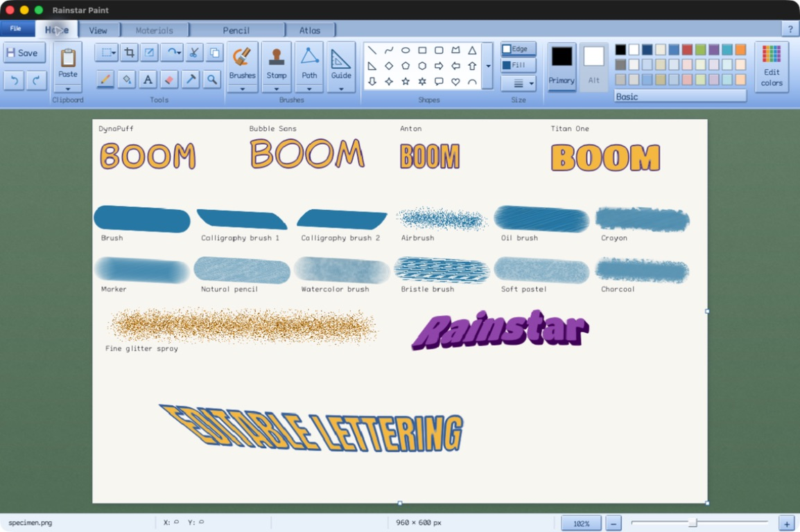

To the Holy One, blessed be He, from whom all good things come. We dedicate this work in gratitude for the nourishment that sustains human life, the energy that powers our tools, and the opportunity to weave information into works of use and beauty.

# Plan Paint

[](https://github.com/falseywinchnet/plan-paint/actions/workflows/build.yml)
[](https://github.com/falseywinchnet/plan-paint/releases/latest)
[](LICENSE)

A free drawing application with the familiar Windows 7/10 Paint ribbon, built on native GUI.Forms for Mac, Windows and Linux. Draw, paint, add text and edit pictures, with snapping paths, patterned brushes, reusable stamps and CONV image transforms.



Rainstar Paint 0.3.2, the predecessor to Plan Paint, shown on Apple Silicon Mac. The specimen was painted by the native brush and lettering tools and reopened as a flattened PNG. [Explore the illustrated guide and screenshots](https://paymenottowork.com/plan-paint/).

## Download

| Platform | Download | Requirements |
| --- | --- | --- |
| Apple Silicon Mac | [macOS installer](https://github.com/falseywinchnet/plan-paint/releases/download/v1.0.0/plan-paint-1.0.0-macos-arm64.pkg) | macOS 26 or newer. Install, then open Plan Paint from Applications. |
| Windows x64 | [Portable ZIP](https://github.com/falseywinchnet/plan-paint/releases/download/v1.0.0/plan-paint-1.0.0-windows-x64.zip) | Extract the folder and run `plan-paint.exe`. |
| Linux x64 | [Portable archive](https://github.com/falseywinchnet/plan-paint/releases/download/v1.0.0/plan-paint-1.0.0-linux-x64.tar.gz) | X11 (including dwm), or Wayland with XWayland. Extract the complete folder and launch `Plan Paint`. |
| Linux ARM64 | [Portable archive](https://github.com/falseywinchnet/plan-paint/releases/download/v1.0.0/plan-paint-1.0.0-linux-arm64.tar.gz) | The same X11/XWayland requirements; use this archive on ARM64. |

[Release notes](https://github.com/falseywinchnet/plan-paint/releases/latest) · [SHA-256 checksums](https://github.com/falseywinchnet/plan-paint/releases/download/v1.0.0/SHA256SUMS) · [Report a problem](https://github.com/falseywinchnet/plan-paint/issues)

The Mac application is ad-hoc signed; its installer is unsigned and has no Developer ID notarization. macOS may require approval in **System Settings → Privacy & Security**. “Windows 7/10” describes the Paint interface; Windows 7 operating-system compatibility has not been verified.

## In development: 1.1.0

Plan Paint adds operating-system language detection, a language selector in Settings, and 22 external language packs covering menus, tools and the in-app guide. English remains compiled into the application. Bundled fonts and improved text layout support Arabic, Hebrew, Indic scripts and CJK text. Language changes take effect after restarting.

Settings → Canvas controls provides drawing coordinates, movement steps, separate Start stroke and Finish stroke actions, and checkbox alternatives to held modifiers. Spirograph pegs and the custom pattern canvas gain additional keyboard and accessibility actions. GUI.Forms exposes control semantics on macOS, Windows and Linux; end-to-end assistive-device usability testing is still in progress.

See [accessibility and platform validation](docs/ACCESSIBILITY.md), [language packs](languages/README.md), and the [1.1 release notes](docs/releases/1.1.0.md). The downloads above remain the published 1.0.0 release.

## New in 1.0.0

Plan Paint is the new name of Rainstar Paint. The native GUI.Forms application is the primary and only released frontend. The SDL/ImGui version is deprecated and retained solely for historical comparison. Version 1.0 includes the new application icon, refreshed in-app help, interface hue controls, atomic saving and crash recovery.

- Fill → Use gradient opens a Gradients ribbon with twelve presets, 2–32 draggable color stops, linear angle and circular modes, independent stop colors and transparency. Gradient fills respect connected regions, selections and guides. See [gradient fills](docs/GRADIENTS.md).

- Selection dithering and posterization use refined OKLab palettes. Dithering also fits how palette colors mix, preserving more tonal range while discouraging harsh, unrelated color speckles.
- Crosswind transports only color error the palette can represent, preventing accumulated fringes and ripples. Weave, Scrambled and Drift retain their distinct lattice patterns.
- Existing artwork with no more colors than requested stays exact, including rare and narrow repeating colors. Palette sampling no longer uses a fixed stride through the source image.
- The dithering brush's brightness/saturation switch no longer overlaps the stabilizer field. Its drawing behavior is unchanged.

## New in 0.3.9

- Paint-authored tool cursors have precise contact points and native fallbacks. Magnifier and stamp previews remain unobstructed.
- Spirograph has translucent guides and inserts, component catalogs, movable ink pegs, and per-peg brush media. Gel pen adds a solid stroke with subtle variation and glints. The apparatus follows the same dismissal rules as ordinary guides.
- Materials adds classic tiled patterns and a separate custom pattern canvas with its own size, undo history, and saved tile.
- Selection → Dither / posterize offers Crosswind, Weave, Scrambled, Drift, and plain posterization with 2–32 colors, a prepared preview, preserved alpha, and one-step Undo.
- Brushes → Dithering brush softly scatters changes toward the center of its disk. Use neighborhood half-blending, or enable light brightness/saturation noise in the Tool ribbon. Existing pixels supply the colors; active selections remain protected.

See [Spirograph](docs/SPIROGRAPH.md), [custom patterns](docs/CUSTOM_PATTERNS.md), [tool cursors](docs/CUSTOM_CURSORS.md), and [dithering](docs/DITHERING.md).

## New in 0.3.6

- **Freehand shape** in the Path menu closes and paints a drawn outline on release, using Edge, Fill, Primary and Alt materials.
- **Magic wand** selects similar colors across the whole canvas, including disconnected islands.
- **Optional working-view rotation** is off by default. Enable its canvas-corner grip in Settings, drag to rotate, and right-click to return to the original pixel view. Drawing stays in original document coordinates; view rotation adds no image-history step.
- Arrow keys pan; Shift pans farther. Alt+arrows retain selection nudging and atlas navigation. The hand-held color picker sets Primary or Alt on click and pans when dragged.
- The Eraser icon contains its operation menu; the Eraser tab retains effect controls. Custom size follows 64 px in the size menu, accepts 1–1024 px, and is also available from the status bar.
- Prepared transform previews use CONV point synthesis; committed affine and mesh transforms integrate destination pixel areas. Resizing integrates each changed axis while preserving unchanged dimensions.
- Rotated-view images publish before native painting to prevent flashing. View updates are batched, CONV preparation waits for release or a short pause, workers are reused, and stamp preparation survives repeated placement.

The optional rotated view still uses a large CONV preparation cache. Nonconstant sources above its one-million-pixel limit, and images awaiting preparation, use direct pixel feedback. The original canvas pixels are never replaced by the rotated view.

## New in 0.3.5

- Canvas selections persist across tool changes and constrain drawing, fill, brushes, stamps, erasing, shapes, paths and text. Lasso holes stay protected; fill cannot cross unselected space to reach a separate island. Escape deselects.
- Pasted images remain floating above the canvas and do not constrain painting underneath. Copy and move use the current selected artwork; Undo and Redo retain the selection with the edit.
- Four gold edge handles skew selected artwork and its mask. Top and bottom handles slide horizontally; side handles slide vertically, keeping the opposite edge fixed.
- Lines and preset shapes default to click, move, click. File > Settings > Lines and shapes retains click, hold, release as a saved option. Escape or right-click cancels an unfinished shape.
- Ctrl-centered drawing extends to closed shapes. Rectangles and similar shapes grow symmetrically; circles, stars and regular polygons grow by radius.

## New in 0.3.4

- Carpet generates native fiber textures with twelve presets and ten controls, from velvet pile to tangled felt. Open the Brushes arrow and choose **Carpet generator…**.
- Optional Horn hillshade adds relief to the fabric color. Dye color and a new-fiber seed control are included.
- Twelve fabric backings are available in Settings; the original grey-blue backing remains unchanged.
- Occluded fiber samples are rejected before intersection work, and the shadow pass omits unused surface calculations. Painting uses a cached tile; generation scratch and per-gesture coverage storage are released after use.
- Experimental state tracking, momentum damping and sparse smoothing are archived outside the application. The conventional stabilizer remains available.

See [Carpet textures](docs/CARPET.md) for the controls, renderer and measured optimization.

## New in 0.3.3

- Selected tools and toggled command buttons use a gold fill.
- Primary and Alt stay independently selectable, including with a solid Primary. Right-click drawing uses Alt, and Alt carries body remains available for shapes and paths.
- Removed Flux knots from the Mix brush effects.
- Text caret blinking repaints the caret area instead of the whole canvas.

## New in 0.3.2

- Blue button faces at rest, darker selection and restored raised/pressed relief.
- Clicking Guide again unsets it. Cut with a guide and no pixel selection preserves the image, clipboard and history.
- Guide has Edit guide, Swap segment (Bézier or Arc) and Unset guide commands, with editable curve handles.
- Moss, brown and tan surrounds use a quieter, finer cloth texture inspired by pool-table felt.

## New in 0.3.1

The Royale Cobalt interface adds light raised controls, layered tabs and inset material trays. Collapsing the ribbon keeps the artwork stationary. File > Settings offers moss, brown and tan felt, plus matte slate, clay and ivory backings; the original pale backing remains the default. About Plan Paint now uses an in-house dialog. This release also fixes pencil strokes, path and Guide junctions, additive and subtractive lasso regions, stamp material capture, and the color picker.

The source includes the [new painting and lettering tools](docs/PAINTING_TOOLS.md): additive, Mix and Heal brushes; guides and tightening lassos; atlas texture painting; poster lettering; and RGB/OKHSL palettes.

The [file and codec audit](docs/SECURITY_AUDIT_2026-09-19.md) and [memory-leak audit](docs/MEMORY_LEAK_AUDIT_2026-09-19.md) describe the hardening changes, exercised paths and remaining platform evidence limits.

## Make something

- **Draw and paint.** Pencil, twelve brushes, 37 shapes (including a constrained circle, Bézier and Arc), flood fill, eraser, eyedropper and adjustable outlines. Use solid colors or eighteen two-color patterns.
- **Bend a curve.** Choose Bézier or Arc, then click the two endpoints of its starting line, or drag when that option is enabled in Settings. Bézier has one control handle from each end; Arc has one middle handle. Drag them repeatedly to adjust the curve. Undo and Redo retain the controls. Escape or choosing another tool releases them and keeps the accepted drawing; a lone first click is cancelled without leaving a mark.
- **Edit sprite sheets.** Set rows and columns in Atlas, choose a sprite from the ribbon, and use Left / Right to step through frames. Ctrl-click holds a sequence; Expand gallery preserves the sheet’s two-dimensional arrangement. Save writes the complete sheet.
- **Edit pictures.** Rectangular and free-form selections, crop, copy/paste, resize, rotate, flip and undo/redo. Drop an image into the window to place it as a movable selection.
- **Add text and color.** Move and resize text boxes, toggle word wrap, and choose a font, size, bold, italic, underline or strikeout. Place or cancel from the floating toolbar. Mix colors with RGB, hex or OKLab controls and save twenty-nine custom swatches beside a permanent transparency swatch.
- **See before you mark.** The pencil previews its exact pixel, the round pink eraser offers hard and soft edges, and the magnifier enlarges the hovered region. Click to zoom around the pointer, up to 1600%.
- **Work with materials.** Procedural watercolor, oil, bristles, crayon, graphite, pastel and charcoal respond to paper tooth, grain scale and paint load. Choose independent Primary and Alt brushes and patterns together in the Materials ribbon. No Color makes either material transparent.
- **Control the workspace.** Click the selected ribbon tab to collapse or reopen it. File > Settings saves the wheel and trackpad scroll distance; scrolling keeps the viewport center within the canvas.
- **Follow a path.** Connect new segments to any earlier junction and keep drawing through loops. **Right-drag a junction** to move it. Click a junction to begin a branch, or click empty canvas to begin another run after right-clicking to end the current one. **Undo** removes one node and its segment at a time; **Redo** restores them. **Escape** or choosing another tool releases the nodes.
- **Stamp an object.** Choose from 39 stamp masks, including stars, arrows, hearts, callouts and curves, and print repeated copies. **R** rotates, **Shift+R** rotates backward, and **+ / −** changes size. Drag the Scale and Angle labels in the Stamp ribbon to scrub their values. **Right-click**, **Escape**, or **Stamp → Lift a new stamp** clears the sample so the next click chooses another source.
- **Turn and reshape.** Drag the round handle at a selection's upper-right corner to rotate freely; hold **Shift** for 15-degree steps. Lasso an object and choose **Selection → Mesh** to stretch it with control points.

**F1** opens the yellow help sidebar, with step-by-step instructions and keyboard shortcuts. The drawing workflow needs no account or network connection. Idle windows wait for input. The native interface renders on the CPU and presents changed areas. Linux packages include their musl loader, library dependencies, X11 locale data and fonts; they do not download or install packages when launched. Native Wayland without XWayland and mixed-DPI Linux displays are not supported by this release.

Print and page setup use native system dialogs on Mac and Windows. Linux provides paper, orientation, margin, printer and copy controls, and submits PostScript to a configured CUPS `lp` service. Scanner capture and desktop backgrounds use available operating-system services. On Mac and Linux, scanner capture opens a separate application; save the scan there, then drop it into Paint.

### Image formats

| Open, paste or drop | Save |
| --- | --- |
| PNG, JPEG, direct-color BMP, uncompressed RGB/RGBA TIFF, TGA, WebP, AVIF, SVG, ICO, CUR; HEIC/HEIF on macOS | PNG, JPEG, BMP, TIFF, TGA, multi-size ICO and CUR |

PNG, TIFF and TGA preserve transparency. JPEG and BMP flatten onto white. GIF is not accepted because the available decoder is unsafe for untrusted files. WebP, AVIF and HEIC/HEIF are import-only and save to another supported raster format; HEIC/HEIF uses the codecs available through macOS ImageIO. Paletted BMP and compressed, tiled, grayscale or multi-page TIFF imports are also rejected; convert them to PNG first. SVG is rasterized on import with LunaSVG, including text, clipping, masks and gradients. Filters and raster `<image>` elements are rejected so SVG cannot read local files or reach LunaSVG's older embedded image decoder. Animated WebP and APNG are rejected.

ICO and CUR open every stored size in Atlas. CUR retains per-image hotspots, editable numerically or by clicking the canvas. Save As from a picture offers standard icon sizes. Legacy AND/XOR cursor pixels are retained; these background-dependent pixels cannot be combined with partial-alpha pixels in one legacy bitmap. Erase or paint over XOR pixels before lifting selections or resampling; exact flips and quarter-turns retain them. Exporting an ICO/CUR entry to a regular raster format exports the current image; saving the container retains every entry.

Atlas uses flat canvases with a maximum of 4096 grid cells. Filename tokens such as `sprite`, `spritesheet`, `atlas`, `tileset`, `walk` and `idle` automatically offer grid setup; any picture can use Atlas manually. Rows and columns come first, with optional margins and spacing. Unused edge pixels are preserved. Grid setup and navigation do not change the picture, and edits participate in undo/redo across frames. Leave grid to resize or crop the whole sheet.

### Transform limits

Free rotation, transformed stamps and reshape use a continuous CONV field compiled from the original selection. Rotation and selection resizing follow the pointer immediately using a display-only preview; releasing commits the CONV result from the original pixels. Field preparation runs in the background and may take a few seconds. A source selection is limited to one million pixels because the double-precision field requires substantial memory. Unchanged stamps are ready immediately without preparing a transform. Normal editing supports up to 100 megapixels, subject to available memory; undo history is bounded to approximately 256 MiB.

Reshape uses a triangle mesh and rejects folds. Final antialiasing uses bounded numerical sampling; very strong reductions and very thin features can still alias. The implementation follows the [CONV research](https://github.com/falseywinchnet/papers_please/blob/main/conv_paper_composed.tex).

## Build

Requires **C++20**, **CMake 3.24+**, the pinned **GUI.Forms SDK**, **libtiff**, **libwebp**, and **dav1d**. CMake downloads pinned libavif, LunaSVG (with PlutoVG) and TinyXML-2 sources. GUI.Forms supplies native window hosts, controls, input, dialogs, fonts and CPU rendering. The default application does not link SDL, ImGui or GTK.

Fetch the checksum-verified toolkit source, build and install its SDK, then build Paint against that installation. The complete recipes are in [Native build and platform notes](docs/GUI_FORMS_PORT.md). With an installed SDK:

```sh
cmake -S . -B build-forms -DCMAKE_BUILD_TYPE=Release \
  -DGUIForms_DIR=/path/to/sdk/lib/cmake/GUIForms
cmake --build build-forms --parallel
ctest --test-dir build-forms --output-on-failure
```

The [build workflow](.github/workflows/build.yml) builds Windows with MinGW and Linux with musl, runs the native tests, and produces portable packages. Linux packages are also launched on a glibc host without an installed musl loader. `RAINSTAR_LEGACY_UI=ON` explicitly builds the deprecated `plan-paint-legacy` frontend; it is off by default and is not supported or packaged for release. Packaging scripts read the release version from CMake.

Tests cover image editing, formats, numerical transforms, transparency, real UI input, display scaling and idle rendering. Run `python3 scripts/check-style.py` before submitting a change. Optional `RAINSTAR_BENCHMARKS=ON` and `RAINSTAR_COMPILER_REPORTS=ON` produce a timing/checksum harness and compiler assembly reports.

## The name

> "For I know the plans I have for you, declares the LORD, plans to prosper you and not to harm you, plans to give you hope and a future."

— Jeremiah 29:11

## Credits and license

**Author:** Astra

**Sponsor:** Rainstar

Original code, documentation and artwork are [MIT licensed](LICENSE), copyright © 2026 joshuah.rainstar@gmail.com. You may use, study, modify and share the software, including commercially. Dependencies retain their [third-party notices](THIRD_PARTY_NOTICES.md).

Plan Paint is an independent implementation. Microsoft and Windows are trademarks of Microsoft Corporation; no Microsoft Paint source code or icon assets are included.

The native application is implemented in `src/forms/`; shared image editing and file-format code live in `src/`. The earlier comparison interface remains in `src/app*` and is excluded from the default build. See [resource measurements](docs/PERFORMANCE.md) for package, startup and memory details.
