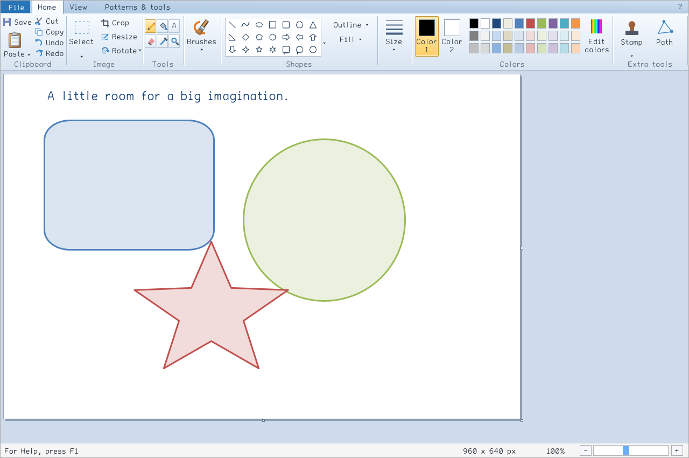

To the Holy One, blessed be He, from whom all good things come. We dedicate this work in gratitude for the nourishment that sustains human life, the energy that powers our tools, and the opportunity to weave information into works of use and beauty.

# Rainstar Paint

[](https://github.com/falseywinchnet/rainstar-paint/actions/workflows/build.yml)
[](https://github.com/falseywinchnet/rainstar-paint/releases/latest)
[](LICENSE)

A free drawing application with the familiar Windows 7/10 Paint ribbon, built for Mac, Windows and Linux. Draw, paint, add text and edit pictures, with snapping paths, patterned brushes, reusable stamps and CONV image transforms.



## Download

| Platform | Download | Requirements |
| --- | --- | --- |
| Apple Silicon Mac | [macOS installer](https://github.com/falseywinchnet/rainstar-paint/releases/download/v0.1.4/rainstar-paint-0.1.4-macos-arm64.pkg) | macOS 26 or newer. Install, then open Rainstar Paint from Applications. |
| Windows x64 | [Portable ZIP](https://github.com/falseywinchnet/rainstar-paint/releases/download/v0.1.4/rainstar-paint-0.1.4-windows-x64.zip) | Extract the folder and run `rainstar-paint.exe`. |
| Linux x64 | [Portable archive](https://github.com/falseywinchnet/rainstar-paint/releases/download/v0.1.4/rainstar-paint-0.1.4-linux-x64.tar.gz) | Ubuntu 22.04 or newer with a graphical desktop and GTK 3. Extract and launch `Rainstar Paint`. |

[Release notes](https://github.com/falseywinchnet/rainstar-paint/releases/latest) · [SHA-256 checksums](https://github.com/falseywinchnet/rainstar-paint/releases/download/v0.1.4/SHA256SUMS) · [Report a problem](https://github.com/falseywinchnet/rainstar-paint/issues)

The Mac application is ad-hoc signed; its installer is unsigned and has no Developer ID notarization. macOS may require approval in **System Settings → Privacy & Security**. “Windows 7/10” describes the Paint interface; Windows 7 operating-system compatibility has not been verified.

## Make something

- **Draw and paint.** Pencil, twelve brushes, 36 shapes (including a constrained circle), curves, flood fill, eraser, eyedropper and adjustable outlines. Use solid colors or eighteen two-color patterns.
- **Edit pictures.** Rectangular and free-form selections, crop, copy/paste, resize, rotate, flip and undo/redo. Drop an image into the window to place it as a movable selection.
- **Add text and color.** Move and resize text boxes, toggle word wrap, and choose a font, size, bold, italic, underline or strikeout. Place or cancel from the floating toolbar. Mix colors with RGB, hex or OKLab controls and save sixteen custom swatches.
- **See before you mark.** The pencil previews its exact pixel, the round pink eraser offers hard and soft edges, and the magnifier enlarges the hovered region. Click to zoom around the pointer, up to 1600%.
- **Work with materials.** Procedural watercolor, oil, bristles, crayon, graphite, pastel and charcoal respond to paper tooth, grain scale and paint load. Choose separate outline and fill media in the Patterns & tools ribbon.
- **Follow a path.** Connect new segments to any earlier junction and keep drawing through loops. Press **Escape** to finish.
- **Stamp an object.** Lift a circle, pill, square or rectangle and print repeated copies. **R** rotates, **Shift+R** rotates backward, and **+ / −** changes size. Open **Stamp → Lift a new stamp** to choose another source.
- **Turn and reshape.** Drag the round handle at a selection's upper-right corner to rotate freely; hold **Shift** for 15-degree steps. Lasso an object and choose **Patterns & tools → Mesh** to stretch it with control points.

**F1** opens the yellow help sidebar, with step-by-step instructions and keyboard shortcuts. The drawing workflow needs no account or network connection. Idle windows wait for input and avoid submitting unchanged frames to the GPU.

Print and page setup use the system dialog. Scanner capture, email drafts and desktop backgrounds use available operating-system services. On Mac and Linux, scanner capture opens a separate application; save the scan there, then drop it into Paint.

### Image formats

| Open, paste or drop | Save |
| --- | --- |
| PNG, JPEG, BMP, GIF, TIFF, TGA, WebP, PSD composite, PNM, HDR, PIC | PNG, JPEG, BMP, GIF, TIFF, TGA, lossless WebP |

PNG, TIFF, TGA and WebP preserve transparency. JPEG, BMP and GIF flatten onto white; GIF also reduces the palette. Animated GIF opens its first frame. HDR is converted to 8-bit RGBA. Saving produces a flat image.

### Transform limits

Free rotation, stamps and reshape use a continuous CONV field compiled from the original selection. Preparation runs in the background and may take a few seconds. A source selection is limited to one million pixels because the double-precision field requires substantial memory. Normal editing supports up to 100 megapixels, subject to available memory; undo history is bounded to approximately 256 MiB.

Reshape uses a triangle mesh and rejects folds. Final antialiasing uses bounded numerical sampling; very strong reductions and very thin features can still alias. The implementation follows the [CONV research](https://github.com/falseywinchnet/papers_please/blob/main/conv_paper_composed.tex).

## Build

Requires **C++20**, **CMake 3.24+**, **SDL3**, **libtiff** and **libwebp**. Linux also requires GTK 3. Dear ImGui, stb and gif-h are vendored.

On an Apple Silicon Mac with Homebrew:

```sh
brew install cmake sdl3 libtiff webp
cmake -S . -B build -DCMAKE_BUILD_TYPE=Release -DCMAKE_PREFIX_PATH=/opt/homebrew
cmake --build build --parallel
ctest --test-dir build --output-on-failure
open build/rainstar-paint.app
```

The [build workflow](.github/workflows/build.yml) provides Windows (ClangCL) and Linux recipes, runs the test suite and produces portable packages. Set `RAINSTAR_SYSTEM_SDL=OFF` to build the pinned SDL release and `RAINSTAR_BUNDLED_TIFF=ON` to build pinned TIFF. Packaging scripts are in `scripts/`; all packages read their version from CMake.

Tests cover image editing, formats, numerical transforms, transparency, real UI input, display scaling and idle rendering. Run `python3 scripts/check-style.py` before submitting a change. Optional `RAINSTAR_BENCHMARKS=ON` and `RAINSTAR_COMPILER_REPORTS=ON` produce a timing/checksum harness and compiler assembly reports.

## Credits and license

**Author:** Astra

**Sponsor:** Rainstar

Original code, documentation and artwork are [MIT licensed](LICENSE), copyright © 2026 joshuah.rainstar@gmail.com. You may use, study, modify and share the software, including commercially. Dependencies retain their [third-party notices](THIRD_PARTY_NOTICES.md).

Rainstar Paint is an independent implementation. Microsoft and Windows are trademarks of Microsoft Corporation; no Microsoft Paint source code or icon assets are included.
